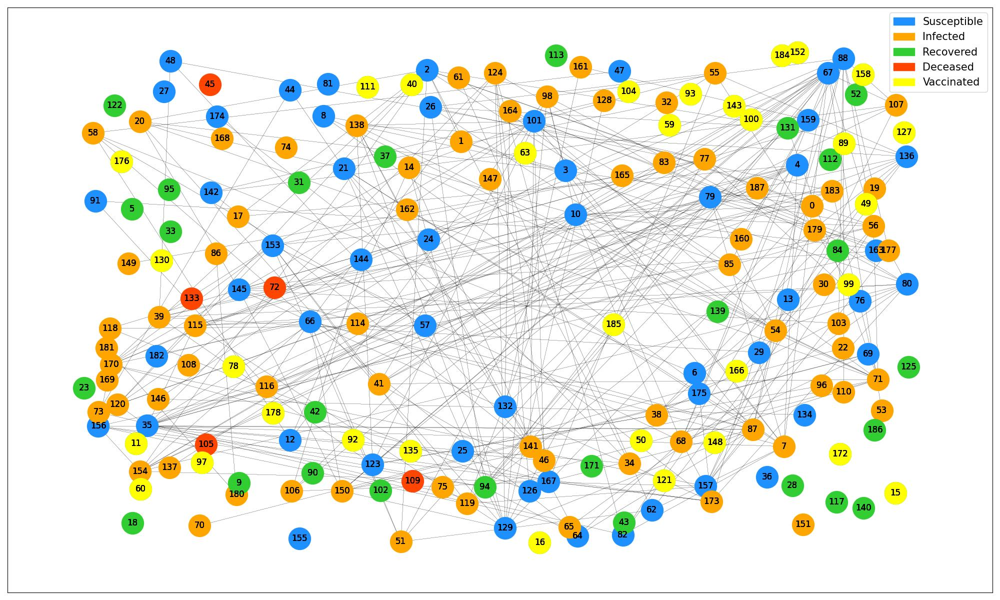

# Modeling and Controlling Epidemic Outbreaks
IEEE NITK year-long project

## Aim

- To build an SIR model and to generate a contact network to perform epidemiological simulation
- To find an optimal vaccine allocation strategy based on various simulations
- To build a web interface that allows users to visualize the outcomes of their epidemic control decisions

## Models Used

### SIR Model

- In general, an SIR model is a compartmental model wherein individuals within a closed population are separated into 3 mutually exclusive groups or compartments, namely Susceptible, Infected and Recovered, based on their disease status. 

- In the SIR model that we have implemented, we have assumed there to be 4 compartments – Susceptible, Infected, Recovered as well as Deceased.

- In the simulation, we are predicting the progression of an epidemic in a community including apartments, offices, schools, and homes over a period of one month. The dataset for the same has been generated using a script. 

- We have also considered a group of people to be vaccinated on day 5 based on 3 different vaccination strategies – Random Vaccination Strategy, Degree Based Vaccination Strategy and Occupation Based Strategy. 

### Contact Network Graph

In the contact network model, people in the community are represented by the nodes of the contact graph and their contacts are represented by the edges. Each compartment is assigned a color and as people move from one compartment to the other, the color of the nodes change accordingly 

## Vaccination Strategies

### 1. Random Strategy

We vaccinated people from the populationr andomly 

### 2. Degree Based Strategy

We vaccinated people who come in contact with the most number of people 

### 3. Metadata based strategy

We vaccinated people based on their jobs, giving priority to those who have a more social lifestyle.

## Future Ventures

As of now the models that we have explored vaccinate people based on available data only. Such vaccination strategies might not always give us the best results as we don’t know the rest of the contact network after a time t. So we also started exploring the idea of using GNNs to trying to to identify the pattern of a given graph and then vaccinate the right nodes based on this prediction.

